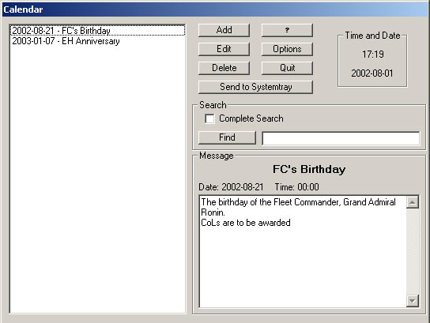



## Emperor's Hamer Calendar

### Description

It works pretty much like a normal calendar, you can enter a event and if you wish chose to be reminded at that date, and if you wish time. The program when not actively used is run in the background, taking up very little resources, and can be accessed through a icon in the system tray.

It has two hardcoded dates (related to the Star Wars club I'm a memeber of) but they can easily be removed, or changed.
 
### More Info
 

             |
---                |---
**Submitted On**   |2002-08-01 17:19:20
**By**             |[Leon Ljunggren](https://github.com/Planet-Source-Code/PSCIndex/blob/master/ByAuthor/leon-ljunggren.md)
**Level**          |Beginner
**User Rating**    |4.7 (14 globes from 3 users)
**Compatibility**  |VB 6\.0
**Category**       |[Complete Applications](https://github.com/Planet-Source-Code/PSCIndex/blob/master/ByCategory/complete-applications__1-27.md)
**World**          |[Visual Basic](https://github.com/Planet-Source-Code/PSCIndex/blob/master/ByWorld/visual-basic.md)
**Archive File**   |[Emperor's\_113727822002\.zip](https://github.com/Planet-Source-Code/leon-ljunggren-emperor-s-hamer-calendar__1-37562/archive/master.zip)

